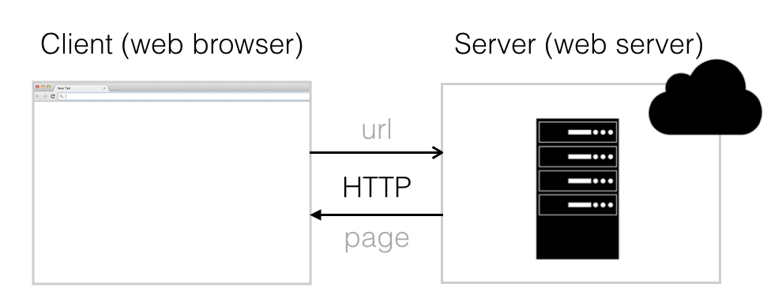

# 1.1 FullStack - Définition

Le web est basé sur un modèle simple _**client-serveur**_ dans un environnement en réseau. Un _**client**_ \(un navigateur\) fait une requête au _**serveur**_ \(un serveur web\) pour une _**ressource**_ \(une page web\) à un certain endroit \(une url\) en utilisant un ensemble de commandes communément compréhensible \(protocole http\). Le serveur récupère alors cette ressource et envoie une réponse au client qui la rend.

Un _**site Web**_ est habituellement une collection de pages Web qui sont statiques, car elles contiennent du contenu qui n'a pas besoin d'être modifié à la demande d'un utilisateur.

Une _**application web**_ est une série de pages web générées dynamiquement et basées sur de multiples facteurs tels que : qui y accède \(l'utilisateur\), quand \(heure\) et comment \(appareil\) et plus encore.

On désigne par _**FullStack**_ est l'ensemble des technologies utilisées pour construire n'importe quelle application web moderne \(comme un blog, un réseau social ou une boutique en ligne\).

### Qu'est-ce que le développement FullStack ?

Le développement FullStack est la capacité d'utiliser un ensemble de technologies pour construire des applications web à partir de zéro.

Les responsabilités de développement FullStack peuvent être réparties en 3 domaines :

* Le développement _**Frontend**_ \(également appelé développement côté client\) - ce sont des tâches et des technologies pour construire des composants de l'application web qui sont affichés sur le navigateur de l'utilisateur.
* Le développement _**Backend**_ \(également appelé développement côté serveur\) - il s'agit de tâches et de technologies pour construire les composants nécessaires au traitement et au stockage des informations pour l'application Web.
* Opérations de développement \(_**Dev Ops**_\) - il s'agit de tâches et de technologies visant à rendre notre application Web accessible aux utilisateurs sur le Web par le biais d'un navigateur.

Auparavant, les connaissances et la maîtrise de l'ensemble du spectre étaient difficiles et rares.

Mais aujourd'hui, en raison de l'avancée des langages et des frameworks qui éliminent la complexité de l'interaction entre ces 3 couches du FullStack, il est devenu possible pour un seul développeur d'apprendre et de maîtriser ces compétences. De tels développeurs sont appelés _**Développeurs FullStack**_.

**FullStack Developer = Frontend + Backend + Dev Ops**

Les développeurs FullStack sont très utiles tant pour les startups que pour les grandes organisations. Au démarrage d'une startup ou d'un projet, les ressources financières et le temps sont limités, un développeur FullStack peut endosser plusieurs rôles et peut travailler à travers les couches FullStack pour construire le produit. Dans une grande organisation avec de nombreux développeurs au sein d'équipes spécialisées, un développeur FullStack peut passer d'une tâche de développement à l'autre et collaborer efficacement entre les équipes.

### Qu'est-ce qu'un développeur JavaScript FullStack ?

FullStack JavaScript est l'utilisation de JavaScript du côté client et serveur. Alors que JavaScript est largement utilisé du côté client pour ajouter de l'interactivité, la création de Node.js \(une technologie JavaScript côté serveur\) qui permet l'utilisation de JavaScript là où d'autres langages traditionnels comme Java, PHP, Ruby, Python ont été utilisés a permis l'utilisation de JavaScript de bout en bout pour construire des applications web.

Le FullStack JavaScript permet un meilleur partage du code entre le backend et le frontend, ainsi que l'utilisation de bibliothèques communes. Cela signifie que la plupart des applications web peuvent être construites en ne connaissant qu'un seul langage. Cela ne signifie pas que nous utiliserons JavaScript là où l'utilisation n'est pas idéale \(par exemple, construire un balisage, créer des styles\) mais nous pourrons l'utiliser pour la majorité du développement de l'application.

### Comprendre les technologies JavaScript FullStack

Bien que nous pourrons nous concentrer sur un seul langage \(JavaScript\), il y aura toujours un certain nombre d'autres technologies que nous devrons apprendre afin de construire des applications web complète.

Nous avons déjà décomposé les technologies d'une application web en 3 couches de Frontend, Backend et DevOps. Décomposons chacune de ces trois couches pour mieux comprendre les technologies que nous devrons apprendre :

### **Développement Frontend**

Le frontend d'une application web concerne l'affichage, le style et l'interaction avec le contenu. Pour créer le frontend, nous utilisons 3 technologies principalement  :

* HTML pour l'affichage du contenu
* CSS pour la mise en forme du contenu
* JavaScript pour permettre l'interaction avec le contenu

_**HTML**_ \(Hyper Text Markup Language\) est un langage basé sur des balises à travers lequel nous pouvons structurer notre contenu en utilisant des balises comme divs, spans, ajouter de l'emphase en utilisant des balises comme strong, et connecter des morceaux de contenu en utilisant des liens.

_**CSS**_ \(Cascading Style Sheets\) est un langage de feuilles de style à travers lequel nous pouvons utiliser des ids, des classes, des tags, des attributs, etc. pour ajouter du style à notre contenu comme la couleur, l'alignement de morceaux de contenu, etc.

_**JavaScript**_ est un langage de programmation à travers lequel nous pouvons ajouter des scripts à notre page web pour ajouter de l'interactivité, de la validation, de l'animation et plus encore.

Dans l'écosystème Frontend, il y a d'autres langages, bibliothèques et outils qui ont été construits sur les trois technologies de base ci-dessus pour faciliter et accélérer la construction d'interfaces Web. Certains d'entre eux incluent :

* Bibliothèques de modèles HTML pour créer des parties ou composants réutilisables , par ex : Handlebars ...
* Les préprocesseur CSS pour structurer les styles, par exemple :  Sass, Less ...
* Des frameworks CSS pour les composants pré-stylés, par ex : Bootstrap
* Des préprocesseur JS pour ajouter du sucre syntaxique à JavaScript, par ex : CoffeeScript \(non utilisé dans ce tutoriel\)
* Des bibliothèques JS pour simplifier des tâches complexes, par ex : jQuery
* Des frameworks JS pour fournir une structure pour de grandes applications, par ex : React.js, Angular, Vue.js ... \(non utilisé dans ce tutoriel\).

### **Développement Backend**

Le Backend d'une application web concerne le traitement et le stockage du contenu. Alors que le Frontend s'exécute dans le navigateur, le Backend s'exécute sur un ou plusieurs serveurs. Le Frontend et le Backend de l'application web interagissent en utilisant des protocoles web comme http.

Afin de créer le backend d'une application utilisant JavaScript, nous utiliserons :

* _**Node.js**_ pour le traitement côté serveur
* _**MongoDB**_ pour le stockage de données

Tout comme l'écosystème Frontend, il y a des frameworks et des bibliothèques dans l'écosystème Backend pour améliorer la productivité des développeurs, exemples :

* Des frameworks Node.js pour faciliter le traitement des demandes \(requêtes\) et des réponses, par ex : Express.js. 
* Des librairie Node.js pour faciliter les tâches courantes, par ex :  Moment.js pour une gestion simplidiée des dates en JS
* Des librairies Node.js pour faciliter l'interaction avec la base de données, par ex :  Mongoose.

### Dev Ops

Après avoir terminé le développement de notre application sur notre machine, nous pouvons la mettre à la disposition de n'importe qui sur Internet en la déployant sur un serveur. Une approche populaire pour déployer une application web est d'utiliser des hébergeurs Cloud comme Amazon EC2 ou Heroku.

