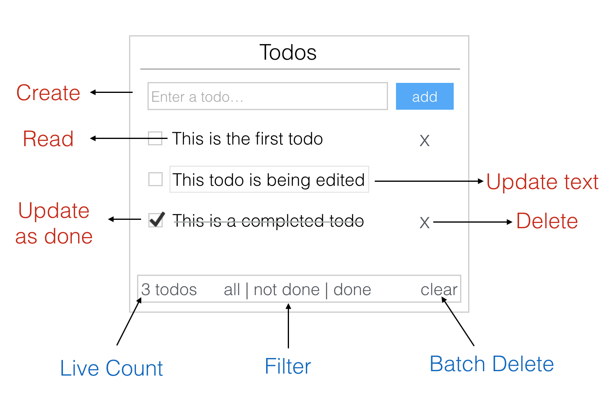
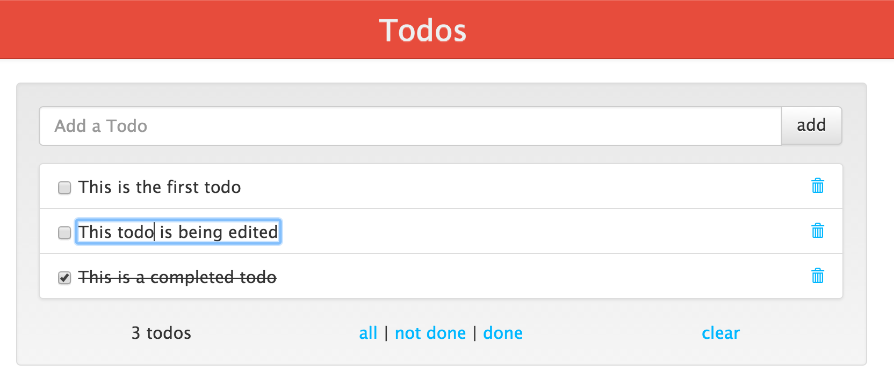
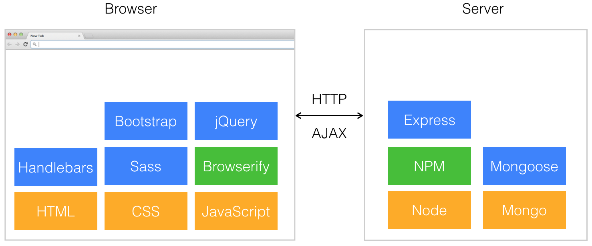

# Introduction

### Bienvenue

Le "FullStack JavaScript Starter Guide" est un tutoriel pas à pas pour construire et déployer des applications web à partir de zéro. Si vous connaissez un peu de HTML, CSS et JavaScript, alors ce livre est fait pour vous.

Commençons ...

### Qu'est-ce que le développement FullStack ?

Le développement FullStack est la capacité de coder et de déployer une application Web de bout en bout - de la création de l'interface utilisateur à la sauvegarde des informations dans la base de données et tout le reste \(et au-delà\). Le développement FullStack nécessite la connaissance d'un large éventail de technologies Web et la capacité de les intégrer pour construire une application Web fonctionnelle. Les développeurs qui possèdent ce vaste ensemble de compétences sont appelés développeurs FullStack.

### Qu'est-ce que le développement _JavaScript FullStack_ ?

FullStack JavaScript est l'utilisation de JavaScript pour le développement de FullStack. Alors qu'il était courant d'utiliser JavaScript pour ajouter une interaction à l'interface utilisateur, la création de Node.js a également permis son utilisation sur les serveurs. Cela fait de JavaScript un excellent candidat pour le développement de bout en bout d'applications web.

### Qu'allons-nous créer comme application ?

Dans ce tutoriel, nous allons construire l'application web **Todos** - une application de type **todo list** pour ajouter, éditer et supprimer des _todos_. Le design et les fonctionnalités de l'application Todos sont inspirés du projet [TodoMVC](http://todomvc.com/).

### Prototype \(aperçu\) de l'application

Voici une image de l'application que nous allons construire avec les fonctionnalités qu'elle supportera :

### Capture d'écran de l'application _Todos_

Voici une capture d'écran de l'application _**Todos**_ :

### Démo

Vous pouvez accéder et tester via le lien suivant l'application finale : ~~Todos~~

### Technologies utilisées

Afin de construire l'application, nous utiliserons un ensemble d'outils qui inclut Node, Express, Browserify, MongoDB et plus encore. Le tutoriel vous présentera également une variété de concepts de développement web comme AJAX, REST, le déploiement de Cloud et plus encore.

Voici une image complète des technologies que nous utiliserons :

### Newsletter

Inscrivez-vous à notre newsletter "~~This Week in FullStack JavaScript~~" pour recevoir les dernières nouvelles de l'écosystème JavaScript dans un format facile à utiliser - Inscrivez-vous dès maintenant sur ~~www.fullstackjs.com/newsletter~~.

